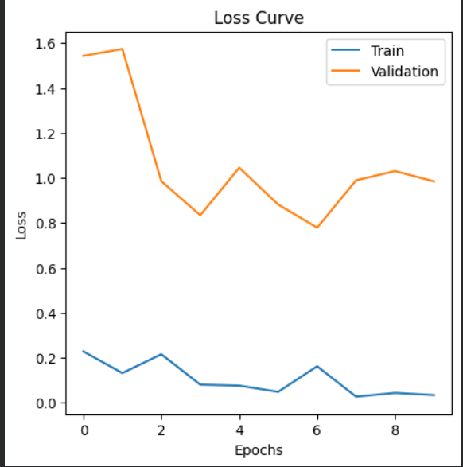
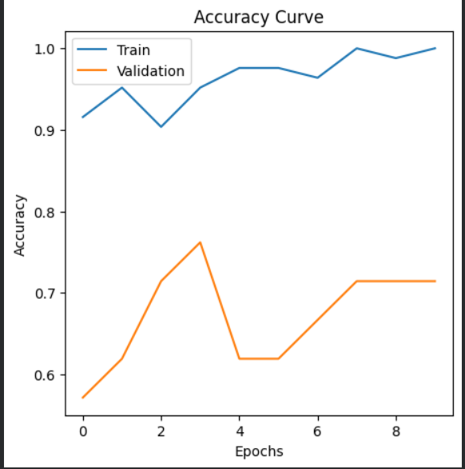

 # Custom Object Image Classifier using CNN

## Overview

For this project, I built an image classification model using a Convolutional Neural Network (CNN) in PyTorch.

The dataset was created by me and contains four object categories (classes) :

* Bottle
* Headphones
* Spiderman
* Watch

Each class contains 26 images captured under different angles and lighting conditions, a total of 104 images. Every class contains equal number of images to prevent biasing. 

The goal was not just to train a classifier, but to understand how neural network training behavior changes when different parameters and regularization techniques are applied.

---

## Model and Training Setup

The model consists of convolutional layers followed by batch normalization, pooling layers, dropout, and fully connected layers.

Training was performed using:

* CrossEntropy Loss
* Backpropagation
* Adam Optimizer

The model was trained and evaluated using a train-validation split.

---

## Experiments Performed

### Baseline Model

Configuration:

* Optimizer: Adam
* Learning Rate: 0.001
* Batch Size: 16
* Epochs: 15
* Dropout: 0.3

Results:

* Validation Accuracy = 71% (appx.)

Observation:

The model achieved very high training accuracy but a very low validation accuracy, indicating overfitting.

<h3>Baseline Model</h3>

  
  

---

### Weight Decay Experiment (Failed Experiment)

I added weight decay (L2 regularization) with a value of 1e-4.

Results:

* Validation Accuracy = 43% (appx.)

Observation:

Although regularization is generally used to improve generalization, validation accuracy dropped in this case. The reason - the datset is small, the model became too constrained and failed to learn effectively.

This experiment showed that regularization can be harmful when applied too aggressively.

---

### Generalization Improvements

To reduce overfitting, I experimented with dropout, learning rate, epochs and batch size.

Observations:

* The gap between training and validation performance became smaller.
* Validation accuracy improved to approximately 76%.
* Validation loss stopped improving after approximately epochs 12–14.

This suggests that training for too long causes the model to memorize the training data instead of learning general patterns.

---

## What Changed and Why

The main challenge was overfitting.

Initially:

* Training loss became extremely small.
* Training accuracy was nearly 100% (overfitting).
* Validation accuracy was much lower.

To improve generalization, I experimented with:

* Dropout
* Weight Decay
* Number of Epochs
* Batch Size

These changes helped me understand the trade-off between fitting the training data and performing well on unseen data.

---

## Things That Failed or Confused Me

One confusing observation was that reducing training loss did not always improve validation accuracy.

I initially expected weight decay to improve performance because it is commonly used as a regularization technique. But, on my small dataset it reduced validation accuracy significantly.

This helped me understand that there is no universal parameter setting and that model behavior depends heavily on the dataset.

---

## Insights and Learnings

Through this project I gained practical understanding of :

* Empirical Risk Minimization
* Backpropagation
* Optimization
* Learning Rate
* Batch Size
* Loss Functions
* Regularization
* Batch Normalization
* Dropout
* Overfitting vs Generalization
* PyTorch Framework

The most important observation was that achieving low training loss is not the same as achieving good generalization. The best-performing model was not the model with the lowest training loss, but the one that balanced learning and regularization effectively.

---

## Conclusion

This project successfully demonstrated how a CNN can classify custom object images and how different parameters affect training behavior. The experiments provided practical insight into optimization and generalization, making the training process more understandable than simply learning the concepts theoretically.

